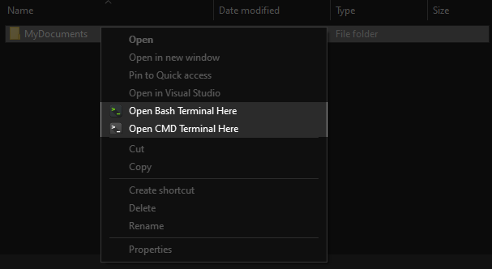

# windows-terminal-launcher

Launcher for [Windows Terminal](https://github.com/microsoft/terminal), provides easy way of adding and removing Windows Explorer context menu entries:
- Automatically detects all profiles configured for [Windows Terminal](https://github.com/microsoft/terminal)
- Picks up profile names from [Windows Terminal](https://github.com/microsoft/terminal) configuration
- Picks up profile icons from [Windows Terminal](https://github.com/microsoft/terminal) configuration
- Allows customizing context menu labels

## How to get it

You can clone this repository using `git clone` and built the project yourself, or just trust a random guy on the internet and download the .exe binary from [here](https://github.com/ofzza/windows-terminal-launcher/raw/master/docs/windows-terminal-launcher.exe).

## How to use it

### Add to Context Menu

To install context menu shortcuts for opening every of your configured (not hidden) profiles in the current directory, run:
```cmd
windows-terminal-launcher.exe --install [--format="Open %P Terminal Here"]
```
... or to install context menu shortcuts for only specified profiles, run:
```cmd
windows-terminal-launcher.exe --install [--format="Open %P Terminal Here"] [--profile="Profile name or GUID"]  [--profile="Another profile name or GUID"] ...
```



_Context menu shortcuts will use the profile name and profile icon from [Windows Terminal](https://github.com/microsoft/terminal) configuration_

### Remove from Context Menu

To uninstall context menu shortcuts for opening each of your configured profiles in the current directory run:
```cmd
windows-terminal-launcher.exe --uninstall
```

### Launch Windows Terminal

To just start a [Windows Terminal](https://github.com/microsoft/terminal) manually specifying the working directory and profile run:
```cmd
windows-terminal-launcher.exe [--directory="c:\"] [--profile="Profile name or GUID"]
```

### Configuring your profiles

To make sure any additional tabs inside the same [Windows Terminal](https://github.com/microsoft/terminal) window keep the same starting directory as the initail tab launched from the context menu, make sure your profile has configured starting directory like so:
```json
{
	"startingDirectory": "."
}
```